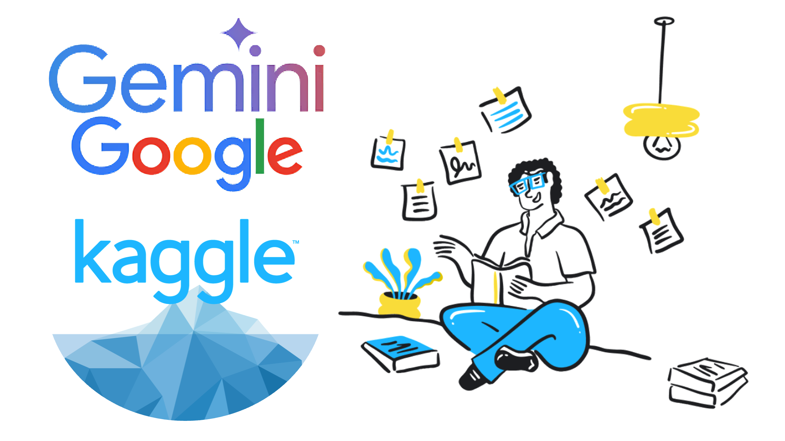

# GenAI Intensive Course by Google

  

I participated in the 5-Day Generative Artificial Inteligence (GenAI) Intensive Course by Google, which was an incredible learning experience. The course, which originally launched in November and was joined by over 140,000 developers, was brought back with updated content, new speakers, and a Kaggle capstone project.

This intensive 5-day online course (March 31 - April 4) provided a deep dive into the fundamentals of GenAI technologies and techniques. Created by Google's ML researchers and engineers, the program offered both theoretical knowledge and practical coding examples that helped me build confidence in tackling GenAI projects.

As part of the course, I had the opportunity to work on a real-world capstone project. The project required completing at least one code lab during the course and then developing a capstone project. This was a great way to build my portfolio and demonstrate my skills. Participants had the chance to compete for prizes including Kaggle certificates, badges, swags, and recognition on Kaggle and Google's social media channels.

## Table of Contents

- [Course Content Overview](#course-content-overview)
  - [Day 1: Foundational Models & Prompt Engineering](./Day%201)
  - [Day 2: Embeddings and Vector Stores/Databases](./Day%202)
  - [Day 3: Generative AI Agents](./Day%203)
  - [Day 4: Domain-Specific LLMs](./Day%204)
  - [Day 5: MLOps for Generative AI](./Day%205)
  - [Capstone Project: From Chaos to Cloud](./Project)
- [Course Materials](#course-materials)

## Course Content Overview

### [Day 1: Foundational Models & Prompt Engineering](./Day%201)

Day 1 provided a comprehensive introduction to the evolution of Large Language Models (LLMs), covering everything from the fundamental transformer architecture to advanced techniques like fine-tuning, inference acceleration, and reasoning models. Through hands-on exercises, I gained practical experience in prompt engineering, learning how to effectively interact with LLMs to achieve optimal results. The day's content was particularly valuable for understanding the core mechanisms that power modern language models.

For those looking to deepen their understanding, I recommend focusing on the following topics from Day 1: the intricacies of transformer architecture, particularly the role of attention mechanisms; advanced fine-tuning techniques like LoRA; and the practical aspects of prompt engineering for different use cases.

#### Key Topics Covered:

##### 1. LLM Text Generation: Top-K and Top-P Sampling

Both **Top-K sampling** and **Top-P sampling (nucleus sampling)** are techniques used in Large Language Models (LLMs) to control the randomness and diversity of the generated text by restricting the selection of the next token to the most probable candidates.

- **Top-K Sampling:**

  - **Selects the top K most likely tokens** from the model's predicted probability distribution
  - The value of **K** determines how many potential next tokens the model considers
  - A **higher K** allows the model to choose from a larger pool of tokens, leading to **more creative and varied output**
  - A **lower K** restricts the choices to the most probable tokens, resulting in **more focused and factual output**
  - If **K is set to 1**, it is equivalent to **greedy decoding**, where the model always selects the single most probable token

- **Top-P Sampling (Nucleus Sampling):**
  - **Selects the smallest set of tokens whose cumulative probability adds up to at least a chosen probability P**
  - The value of **P** (ranging from 0 to 1) determines the threshold for the cumulative probability
  - A **lower P** makes the output **more focused and restrictive**
  - A **higher P** (closer to 1) allows the model to consider a **more diverse range of tokens**
  - A **P of 0** is essentially **forcing that best guess (greedy decoding)**
  - The number of tokens considered in Top-P sampling can **vary dynamically** depending on the probability distribution

##### 2. Low-Rank Adaptation for Efficient Language Model Fine-Tuning

**Low-Rank Adaptation (LoRA)** is a **parameter-efficient fine-tuning technique** for large language models. Instead of fine-tuning all the parameters of a pre-trained LLM, LoRA **freezes the original weights** and introduces a **small number of new trainable parameters**.

Key aspects of LoRA:

- **Parameter Efficiency:** Significantly reduces the number of trainable parameters
- **Frozen Pre-trained Weights:** Original weight matrices remain unchanged
- **Low-Rank Approximation:** Changes needed for a specific task can be represented by a low-rank matrix
- **Plug-and-Play Modules:** Can train different LoRA modules for various tasks and easily switch between them
- **Easier Transfer:** Only need to share the small LoRA update matrices

##### 3. Transformer Networks: The Role of the Feedforward Layer

In LLMs based on the transformer architecture, the **feedforward layer** plays a crucial role in processing information after the self-attention mechanism.

Key functions:

- Applies a **position-wise transformation** to the data
- Incorporates **additional non-linearity and complexity** into the representations
- Consists of **two linear transformations** with a **non-linear activation function** in between
- Enhances the model's representational power
- Contributes to the stability and effectiveness of deep transformer models

The feedforward layer processes each token's representation independently after the attention mechanisms, helping the model learn complex functions of the input.

### [Day 2: Embeddings and Vector Stores/Databases](./Day%202)

Day 2 focused on embeddings and vector databases, covering fundamental concepts that I was already familiar with from previous studies. The day's content included a thorough exploration of embedding methods, vector search algorithms, and their practical applications with LLMs. While the material was well-presented and comprehensive, it primarily reinforced my existing knowledge rather than introducing new concepts. The analysis of tradeoffs between different approaches provided a good opportunity to validate and expand upon my prior understanding of these technologies.

### [Day 3: Generative AI Agents](./Day%203)

Day 3 was dedicated to exploring the fascinating world of Generative AI Agents. Through hands-on exercises and theoretical discussions, I learned how to build sophisticated AI agents and understand their core components. The day provided valuable insights into the iterative development process of AI agents, and I particularly enjoyed exploring the recent developments in agentspace. This session helped me understand how to create more intelligent and autonomous systems that can interact with their environment and users effectively.

### [Day 4: Domain-Specific LLMs](./Day%204)

Day 4 offered a deep dive into specialized Large Language Models, with a particular focus on models like SecLM and Med-PaLM. The most valuable aspect of this day was learning directly from the researchers who built these specialized models. Their insights into the development process and the unique challenges of creating domain-specific LLMs were particularly enlightening. The session provided a comprehensive understanding of how these models are tailored for specific applications and industries, highlighting the importance of domain expertise in AI development.

### [Day 5: MLOps for Generative AI](./Day%205)

The final day of the course focused on adapting MLOps practices specifically for Generative AI applications. I learned how to effectively use Vertex AI's tools for managing foundation models and deploying GenAI applications. The day culminated in the launch of the capstone project, which provided a practical opportunity to apply all the knowledge gained throughout the course. This session was particularly valuable for understanding how to operationalize and maintain GenAI systems in production environments.

### [Capstone Project: From Chaos to Cloud - Teaching AI to Speak TOSCA](./Project)

For my capstone project, I developed a conversational AI system that helps users create properly formatted TOSCA (Topology and Orchestration Specification for Cloud Applications) files through an interactive dialogue. The project addresses the challenge of cloud orchestration and deployment automation by providing an intuitive, conversational interface for generating accurate TOSCA files.

The system leverages several advanced GenAI capabilities:

- Structured output generation for creating properly formatted TOSCA JSON files
- Function calling for file operations
- State graph architecture with specialized nodes (chatbot, converter, human, tool)
- Few-shot prompting with example TOSCA files
- Long context window for maintaining conversation history
- Document understanding for processing TOSCA specifications

Key features include:

- Interactive conversation-based TOSCA file generation
- Step-by-step guidance through all required fields
- Validation of input data against TOSCA specifications
- Automatic JSON file generation and saving
- Support for metadata, nodes, and virtual links configuration

The project demonstrates practical application of the concepts learned throughout the course, particularly in prompt engineering, structured output generation, and building AI agents. It serves as a comprehensive example of how GenAI can be used to simplify complex technical tasks and make them more accessible to users.

## Course Materials

I've organized all the course materials including notebooks, white papers, and review videos in their respective day folders for easy reference and future learning.

---

## Thank You 

Thank you for exploring my journey through the GenAI Intensive Course! This repository contains my notes, learnings, and the capstone project from the course. I hope you find the materials and insights shared here valuable for your own GenAI learning journey. Feel free to explore the day folders for detailed course materials, whitepapers, and practical examples. If you have any questions or would like to discuss any of the topics covered, I'd be happy to connect!
